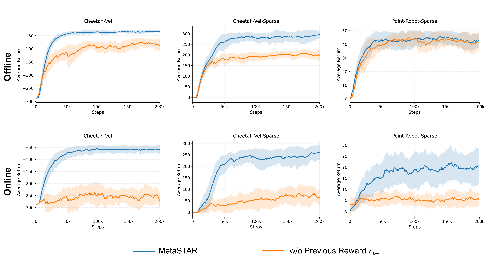
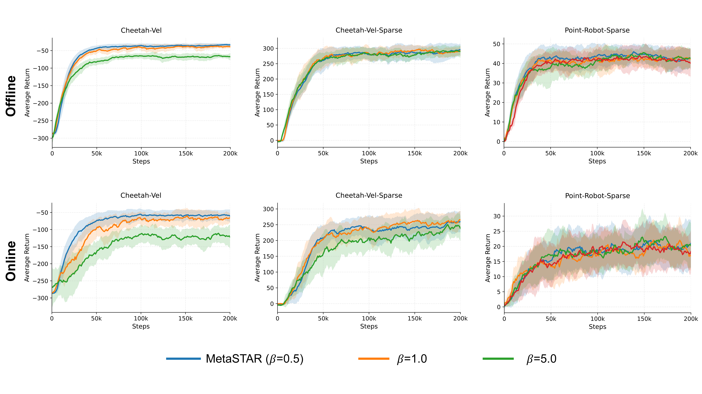
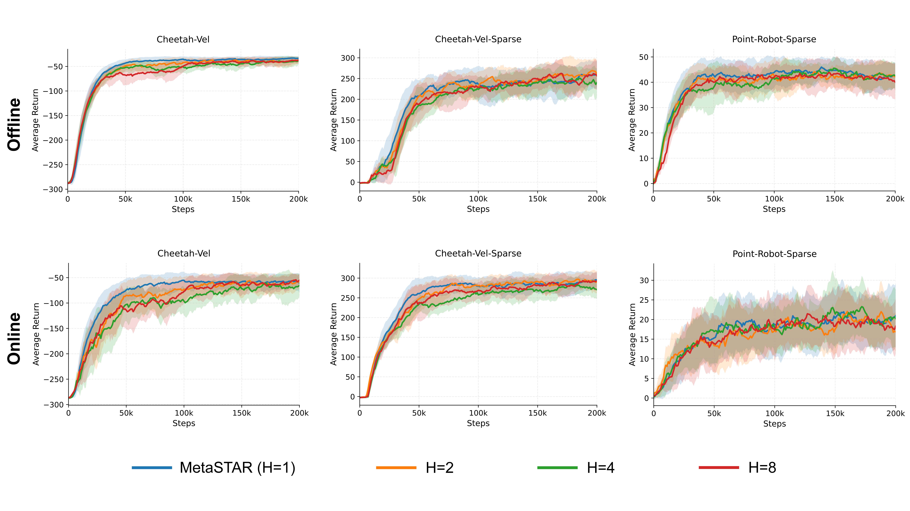
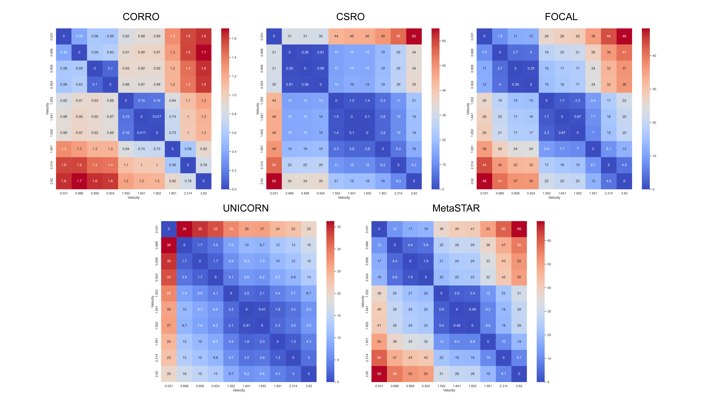
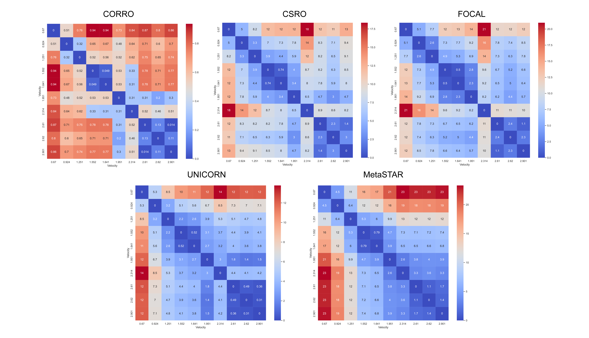
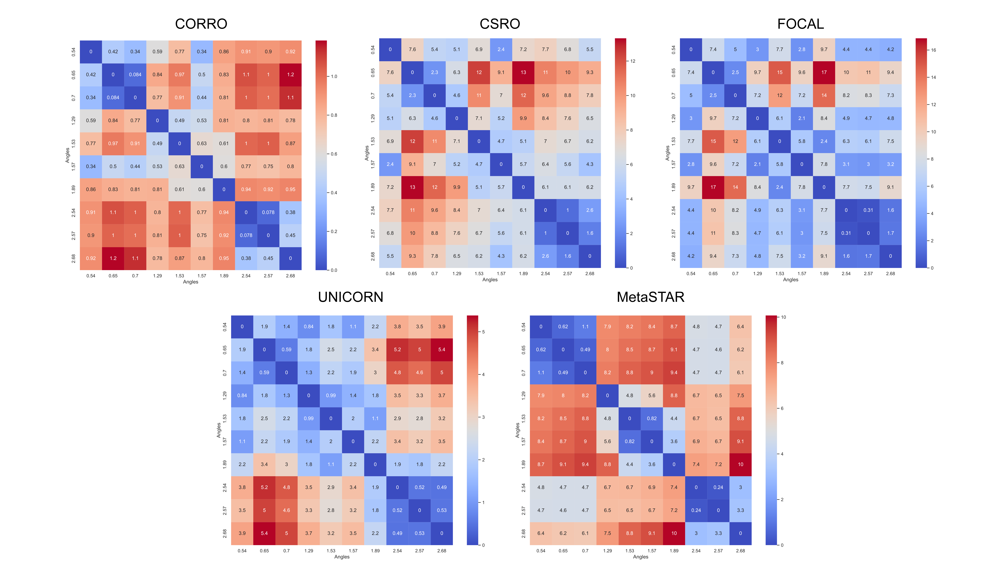

# Code of MetaSTAR

# Additional Experiments

## Fig 1. The ablation study of previous reward in observation oₜ = [sₜ, rₜ₋₁]

## Fig 2. The influence of different β in conservative meta-value objective

## Fig 3. The influence of different imagination horizon H

## Fig 4. Euclidean distance of task representations on Cheetah-Vel. The Goal is velocity, where the velocity is sampled from [0.0, 3.0]

## Fig 5. Euclidean distance of task representations on Cheetah-Vel-Sparse. The Goal is velocity, where the velocity is sampled from [0.0, 3.0]

## Fig 6. Euclidean distance of task representations on Point-Robot-Sparse. The Goal is position (cos(θ), sin(θ)), where the angle θ is sampled from [0, π]

## Table 1. Training time comparison (hours) across environments on a single RTX 4090 GPU
|     Environment     |  CORRO   |   CSRO   |  FOCAL   | UNICORN  | MetaSTAR |
| :-----------------: | :------: | :------: | :------: | :------: | :------: |
|       Ant-Dir       | 8.5±2.4  | 11.6±1.7 | 12.1±2.6 | 10.8±0.7 | 15.2±4.4 |
|     Cheetah-Vel     | 10.6±2.5 | 18.2±0.3 | 17.0±0.9 | 19.4±2.4 | 23.5±0.5 |
|    Hopper-Param     | 9.6±2.0  | 16.1±4.0 | 13.8±3.2 | 17.5±4.3 | 21.7±2.1 |
|    Walker-Param     | 8.9±3.3  | 13.2±4.7 | 12.2±4.6 | 14.2±4.9 | 17.1±4.8 |
| Point-Robot-Sparse  | 6.5±2.3  | 8.8±1.8  | 8.7±1.7  | 9.2±2.7  | 13.0±1.7 |
| Cheetah-Vel-Sparse  | 9.4±2.2  | 11.5±1.0 | 10.9±0.6 | 13.3±0.7 | 17.5±1.1 |
| Hopper-Param-Sparse | 6.2±1.7  | 7.5±0.4  | 7.3±0.2  | 10.3±1.3 | 13.8±0.5 |
| Walker-Param-Sparse | 9.4±1.0  | 16.6±2.1 | 16.0±0.2 | 17.8±0.5 | 20.9±3.5 |